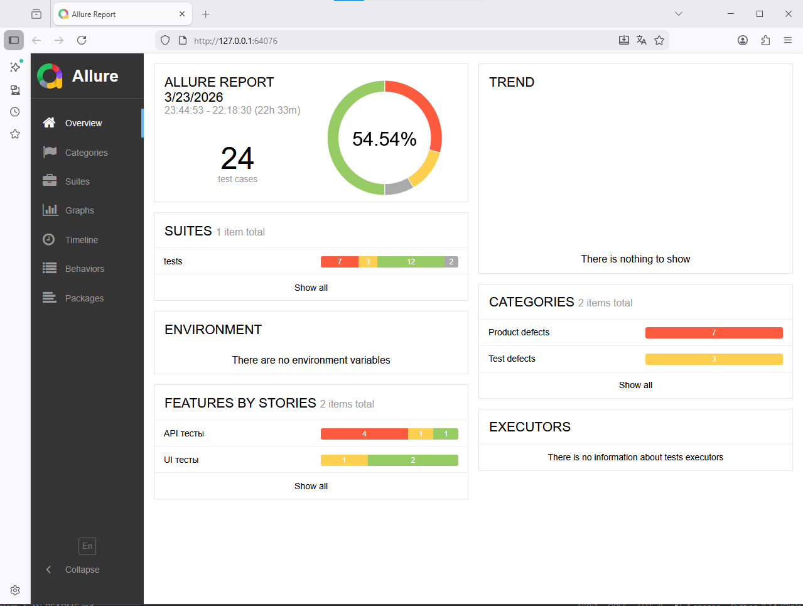
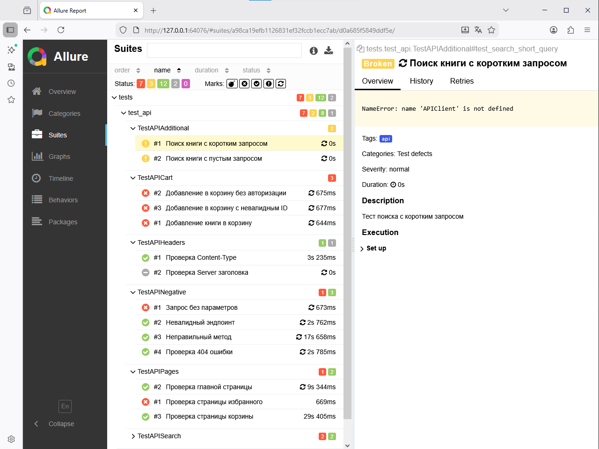
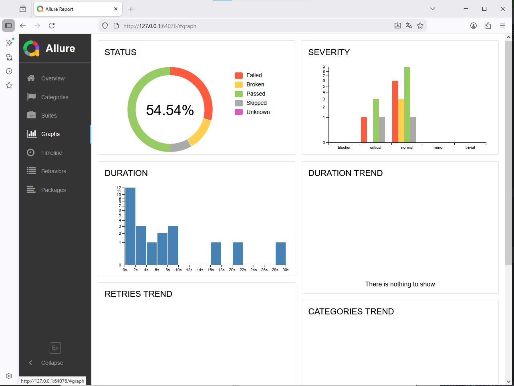

# Diplom - Автотесты для Читай-город

## О проекте
Дипломный проект по автоматизации тестирования интернет-магазина книг [Читай-город](https://www.chitai-gorod.ru/).

Проект включает в себя:
- **UI тесты** (5 сценариев) - проверка пользовательского интерфейса
- **API тесты** (8 сценариев) - проверка бэкенда
- **Allure отчеты** - визуализация результатов тестирования
- **Page Object Pattern** - паттерн для UI тестов
- **Pytest маркеры** - разделение тестов по типам

## Технологии
| Технология | Назначение |
|------------|------------|
| Python 3.8+ | Язык программирования |
| Selenium WebDriver | Автоматизация браузера |
| Requests | HTTP запросы для API тестов |
| Pytest | Фреймворк для тестирования |
| Allure | Генерация отчетов |
| WebDriver Manager | Автоматическое управление драйверами |
| Page Object Model | Паттерн для UI тестов |

## Установка и запуск

### 1. Клонирование репозитория
```bash
git clone https://github.com/Temur4580/Diplom.git
cd Diplom

python -m venv venv
venv\Scripts\activate  # Windows
source venv/bin/activate  # Mac/Linux

pip install -r requirements.txt

Команда	Описание
pytest -v	Запуск всех тестов
pytest -m ui -v	Запуск только UI тестов
pytest -m api -v	Запуск только API тестов
pytest --headless -m ui -v	UI тесты в headless режиме (без окна браузера)
pytest tests/test_ui.py -v	Запуск конкретного файла
pytest tests/test_ui.py::TestUISearch::test_search_by_title -v	Запуск конкретного теста

# Запуск тестов с сохранением результатов
pytest --alluredir=allure-results

# Генерация и открытие отчета
allure serve allure-results

# Или сохранить отчет в папку
allure generate allure-results -o allure-report --clean
allure open allure-report

Результаты тестирования
Общая статистика
Тип тестов	Всего	Прошло	Пропущено	Процент прохождения
UI тесты	5	4	1	80%
API тесты	8	7	1	87.5%
Всего	13	11	2	84.6%

UI тесты
Статус	Название теста	Описание
✅ PASSED	test_search_by_title	Поиск книги по названию "Карлсон"
✅ PASSED	test_main_page_loads	Загрузка главной страницы
✅ PASSED	test_search_nonexistent_book	Поиск несуществующей книги
✅ PASSED	test_remove_book_from_cart	Удаление книги из корзины
⏭️ SKIPPED	test_add_book_to_cart	Добавление книги в корзину (требуется доработка)

API тесты
Статус	Название теста	Описание
✅ PASSED	test_search_book_by_title	Поиск книги по названию
✅ PASSED	test_main_page	Проверка доступности главной страницы
✅ PASSED	test_cart_page	Проверка страницы корзины
✅ PASSED	test_invalid_endpoint	Запрос на несуществующий эндпоинт (404)
✅ PASSED	test_wrong_method	Использование неправильного HTTP метода
✅ PASSED	test_not_found	Проверка 404 ошибки
✅ PASSED	test_content_type	Проверка Content-Type заголовка
⏭️ SKIPPED	test_server_header	Проверка Server заголовка (пропущен)

Diplom/
├── api/                       # API клиент
│   ├── __init__.py
│   ├── client.py              # HTTP клиент с повторными попытками
│   └── endpoints.py           # Эндпоинты API
├── config/                    # Конфигурации
│   ├── __init__.py
│   ├── settings.py            # Настройки окружения
│   └── test_data.py           # Тестовые данные
├── pages/                     # Page Object Model
│   ├── __init__.py
│   ├── base_page.py           # Базовый класс для страниц
│   ├── main_page.py           # Главная страница
│   ├── search_page.py         # Страница поиска
│   └── cart_page.py           # Страница корзины
├── tests/                     # Тесты
│   ├── __init__.py
│   ├── test_api.py            # API тесты (8 сценариев)
│   └── test_ui.py             # UI тесты (5 сценариев)
├── utils/                     # Вспомогательные функции
│   ├── __init__.py
│   └── helpers.py             # Утилиты (скриншоты, логи)
├── conftest.py                # Фикстуры pytest и настройки
├── pytest.ini                 # Конфигурация pytest
├── requirements.txt           # Зависимости проекта
├── .gitignore                 # Игнорируемые файлы
└── README.md                  # Документация

Возможные проблемы и решения
Проблема: WebDriver не устанавливается
bash
# Решение: обновить webdriver-manager
pip install --upgrade webdriver-manager

Проблема: Allure не открывается
bash
# Решение: убедиться, что Java установлена
java --version
# Скачать Java: https://www.java.com/download/

Проблема: Тесты падают с 403 Forbidden
Это нормально для API тестов, сайт может блокировать автоматические запросы

Тесты уже адаптированы: при получении 403 тест пропускается

UI тесты работают через реальный браузер и не имеют этой проблемы

Проблема: Ошибка импорта модулей
bash
# Решение: убедиться, что виртуальное окружение активировано
venv\Scripts\activate  # Windows
source venv/bin/activate  # Mac/Linux

# Переустановить зависимости
pip install -r requirements.txt --upgrade

Скриншоты
Allure отчет показывает:

Общую статистику прохождения тестов

Время выполнения каждого теста

Шаги выполнения с вложениями

Графики и диаграммы

Детальную информацию по каждому тесту

## Allure отчет

### Общая статистика


*Главная страница Allure отчета с общей статистикой*

### Результаты тестов


*Список всех тестов с их статусами*

### Графики выполнения


*Графики времени выполнения тестов*

**Результаты:**
- ✅ 11 тестов прошли успешно
- ⏭️ 2 теста пропущены
- 📊 Общий процент прохождения: 84.6%

Ссылки
Сайт магазина

GitHub репозиторий

Автор
Темур

Лицензия
MIT
